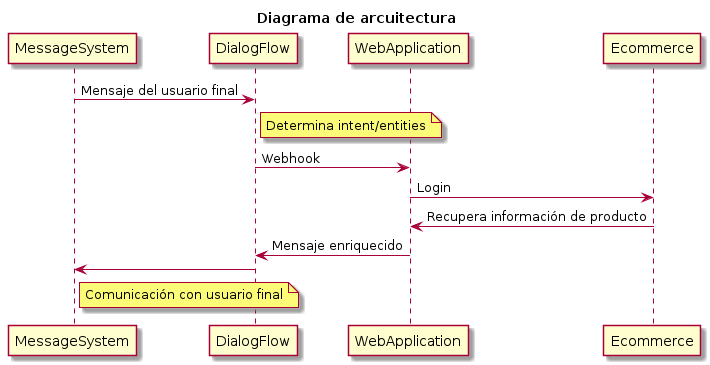

# Chatbot de E-commerce - test by Bosch

<div id="table-of-contents">
<h2>Table of Contents</h2>
<div id="text-table-of-contents">
<ul>
<li><a href="#sec-1">1. Introducción</a></li>
<li><a href="#sec-2">2. Requerimientos previos</a></li>
<li><a href="#sec-3">3. Configuración de DialogFlow</a></li>
<li><a href="#sec-4">4. Configuración del API de E-commerce.</a></li>
<li><a href="#sec-5">5. Configuración de nuestra apliación web.</a>
<ul>
<li><a href="#sec-5-1">5.1. Creación de ambiente virtual (muy recomendable)</a></li>
</ul>
</li>
<li><a href="#sec-6">6. Configuración del Fullfiment en DialogFlow</a></li>
<li><a href="#sec-7">7. Integración con Facebook Messenger</a></li>
<li><a href="#sec-8">8. Integración con Twilio (Whatsapp)</a></li>
<li><a href="#sec-9">9. Agregar Evaluadores</a>
<ul>
<li><a href="#sec-9-1">9.1. En Facebook</a></li>
<li><a href="#sec-9-2">9.2. En Twilio</a></li>
</ul>
</li>
<li><a href="#sec-10">10. License</a></li>
</ul>
</div>
</div>


# Introducción<a id="sec-1" name="sec-1"></a>

En este proyecto se mostrará cómo crear un chatbot en DialogFlow haciendo uso de un API externa para brindar información adicional al usuario, e integrar este chatbot con Facebook y Twilio.

Estos son los elementos que debemos considerar:

-   **Agente de DialogFlow.** DialogFlow incorpora algoritmos de Machine Learning y [Natural Language Processing](https://towardsdatascience.com/an-easy-introduction-to-natural-language-processing-b1e2801291c1) para detectar qué es lo que nuestros usuarios nos quieren decir.
-   **Web Application.** Crearemos una aplicación web con ayuda de Python y Flask para poder recibir las solicitudes de DialogFlow, conectarnos con el API de E-Commerce de Bosch y mandar una respuesta de regreso a DialogFlow. Usaremos Ngrok , que es una herramienta que crear un túnel desde nuestro servidor local, para poder comunicarnos con DialogFlow.
-   **API de E-Commerce de Bosch.** Esta API nos permite acceder a la información de los productos de [www.boschenlinea.com](https://www.boschenlinea.com/) conociendo el número de parte del producto.
-   **Aplicación de Facebook Messenger.** Necesitaremos crear una aplicación en [Facebook for Developers](https://developers.facebook.com). Esta aplicación se encargará de hacer la integración entre Facebook Messenger y DialogFlow para poder comunicarnos con nuestro usuario final.
-   **Twilio**. Permite integrar varios servicios de mensajería con un solo punto de contacto (SMS, Voz, Video y Whatsapp).



# Requerimientos previos<a id="sec-2" name="sec-2"></a>

Antes de iniciar, asegúrate de tener los siguientes requerimientos:

-   Tener [Python 3](https://www.python.org/downloads/) instalado en tu compuradora.
-   Descargar [ngrok](https://ngrok.com/download) y crear una cuenta.
-   Acceder a  [DialogFlow](https://console.dialogflow.com/api-client/#/login)  con una cuenta de Google.
-   Tener una página de [Facebook](https://www.facebook.com/help/104002523024878?helpref%3Dabout_content) creada.
-   Tener una cuenta de [Twilio](https://www.twilio.com/) creada.
-   El editor de textos de su preferencia.


# Configuración de DialogFlow<a id="sec-3" name="sec-3"></a>

1.  Accedemos a la consola de DialogFlow y creamos un nuevo agente. Debemos asegurarnos de seleccionar "español" como idioma principal.
2.  Vamos a la pestaña de **Export and import** dentro de la configuración del agente.
3.  Seleccionamos **RESTORE FROM ZIP** y subimos el archivo **bot<sub>test</sub>.zip** que se encuentra dentro de la carpeta de este repositorio.

# Configuración del API de E-commerce.<a id="sec-4" name="sec-4"></a>

1.  Ingresamos a [www.boschenlinea.com](https://www.boschenlinea.com/).
2.  Creamos una cuenta.
3.  En el archivo **config.py** colocamos nuestro usuario y contraseña en la parte de LOGON<sub>ID</sub> y LOGON<sub>PASSWORD</sub>
4.  Además de eso, necesitaremos colocar las credenciales de Basic Auth en la parte de BASIC<sub>AUTH</sub>. Nosotros les brindaremos estas credenciales.

# Configuración de nuestra apliación web.<a id="sec-5" name="sec-5"></a>

## Creación de ambiente virtual (muy recomendable)<a id="sec-5-1" name="sec-5-1"></a>


1. Nos vamos a la carpeta donde se encuentra el repositorio.
2. Si aun no tenemos instalado el comando para crear ambientes virtuales en python ejecutamos: 
```bash 
pip install virtualenv
```
3. En la consola ejecutamos el siguiente comando para crear nuestro ambiente virtual:


\`\`\`bash
python -m venv venv
```


4. Activamos nuestro ambiente virtual (comando para Windows):


```bash
.\venv\Scripts\activate
```


5. Instalamos los requirements con el siguiente comando:

```bash
pip install -r requierements.txt
```


6. Corremos nuestra aplicación 
```bash
python main.py
```

7. Ejecutamos ngrok.exe (previamente descargado y configurado)

8. Configuramos el token de autorizacion necesario para usar Ngrok. Este token se puede obtener desde la pagina de [Ngrok](https://ngrok.com/)

```bash
ngrok authtoken <TOKEN>

```

9. Creamos el túnel a nuestro local host:


```bash
ngrok http 5000
```


10. Copiamos y guardamos la url https que nos brinda Ngrok.


# Configuración del Fullfiment en DialogFlow<a id="sec-6" name="sec-6"></a>

1.  En la consola de DialogFlow nos dirigimos a la parte de **Fulfillment**
2.  Habilitamos el botón de **Webhook**.
3.  Pegamos la url generada por Ngrok donde doce **Enter URL**.
4.  Probamos que nuestro chatbot funcione en la parte que dice **try it now**, en la esquina superior derecha.


# Integración con Facebook Messenger<a id="sec-7" name="sec-7"></a>

1.  En DialogFlow nos vamos a la parte de **Integrations**
2.  Habilitamos la integración con Facebook Messenger
3.  Colocamos un token de Verificación. (Puede ser cualquier palabra)
4.  Ahora entramos a [developers.facebook.com](https://developers.facebook.com).
5.  En la parte superior damos click a **Mis Apps**
6.  Seleccionamos **Agregar una nueva App**
7.  Colocamos el nombre de nuestra app y un correo de contacto
8.  En la columna izquierda dar click a  **PRODUCTOS**
9.  Buscar **Messenger** en la parte de **Agregar productos** y dar click en **Configurar**
10. En la parte de **Tokens de acceso** seleccionar la página de Facebook en la que quieres integrar el chatbot y dar click en **Editar permisos**.
11. Colocar el Token de acceso a la página generado en la Integración con Messenger de DialogFlow.
12. Dar click a ***Sucribirse a eventos*** en la parte de ***Webhooks*** y colocar el URL de devolución de llamada y el token que aparecen en DialogFlow.
13. Seleccionar la pagina a la que te deseas suscribir y dar click en ***Suscribirse***

# Integración con Twilio (Whatsapp)<a id="sec-8" name="sec-8"></a> 
1.  En la cuenta de Tiwlio ir a la sección **All Projects** en la parte superior izquierda.
2.  Crea un nuevo proyecto, elige la opción **Products** y a continuacion **Programable SMS**
3.  Una vez que el proyecto fue creado, verás el Dashboard del proyecto. En esta sección obtendrás el **Account SID**  y el **AUTH TOKEN**.
4.  En la barra vertical del lado izquierdo verás un icono de mensajes. Da click en él para acceder a la sección **Programable SMS**.
5.  Da click en Whatsapp y luego en Sandbox. Te darán un **Número de teléfono** y un **código** i.e. ****join fish-calm****. Añade ese teléfono a tu agenda y manda un mensaje de whatsap con el código.
6.  En la página de Twilio recibirás la confirmación de que se recibió tu mensaje.
7.  DialogFlow nos vamos a la parte de **Integrations**
8.  Habilita la integración con **Twilio(Text messaging)**
9.  Te solicitarán ingresar el **Account SID**, el **AUTH TOKEN** y el **Número de teléfono** que obtuviste previamente en la página de Twilio.
10. Copia el **Request URL** de esta tarjeta y da click en **Start**.
11. En la Página de Twilio, en la sección de Sandbox Configuration (Whatsapp/Sandbox) configura el endpoint con la etiqueta **When a message comes in** e ingresa el **Request URL** que obtuviste en DialogFlow.
12. Manda un mesaje de Whatsapp al teléfono de Twillio y deberá contestarte el chatbot de DialogFlow.

# Agregar Evaluadores<a id="sec-9" name="sec-9"></a>

## En Facebook<a id="sec-9-1" name="sec-9-1"></a>

El chatbot creado se encuentra en Status de desarrollo hasta que el equipo de Facebook lo verifique. Por esta razón es necesario agregar usuarios como evaluadores de la app de facebook. 

Para esto debemos ir a la parte de **Roles** en la columna izquierda de la página y agregar personas como Evaluadores.
Estas personas deberán ingresar a la página de Facebook para desarrolladores y aceptar la solicitud para poder empezar a usar el bot. 

## En Twilio<a id="sec-9-2" name="sec-9-2"></a>

Para que los evaluadores puedan probar tu bot con Whatsapp será necesario que brindes el **Número de teléfono** y el **código** para unirse al canal. 

# License<a id="sec-10" name="sec-10"></a>

[MIT](https://choosealicense.com/licenses/mit/)

